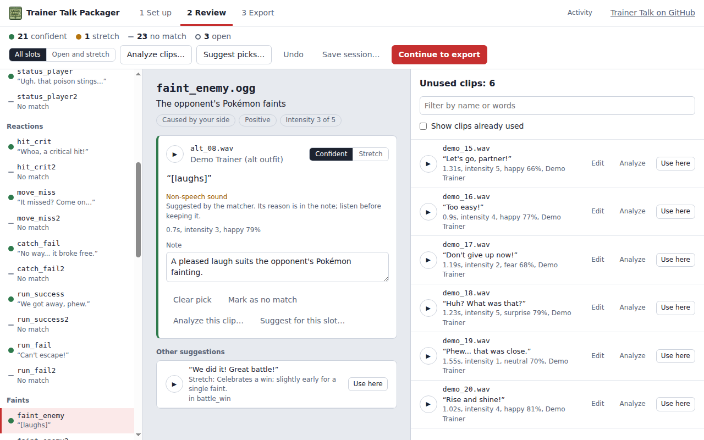
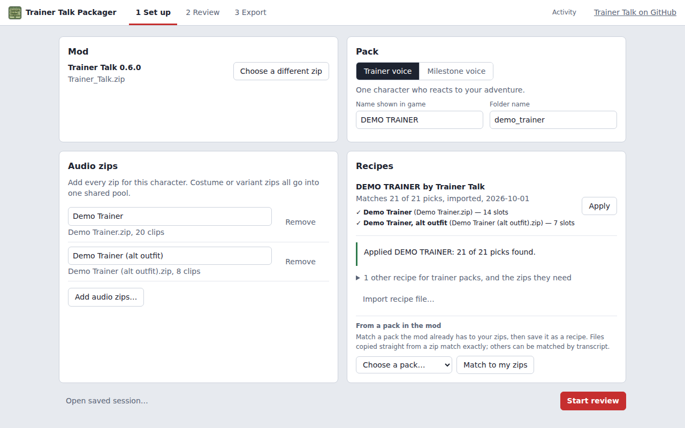
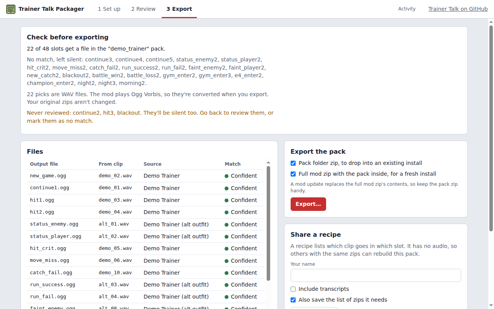
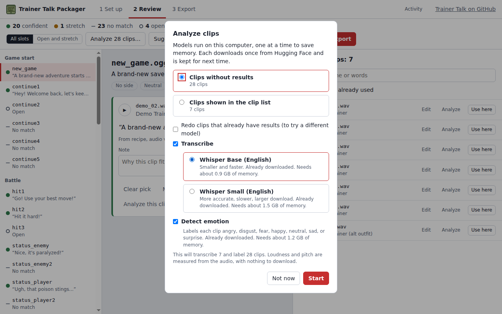
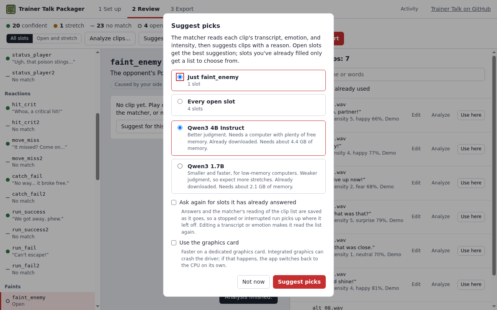
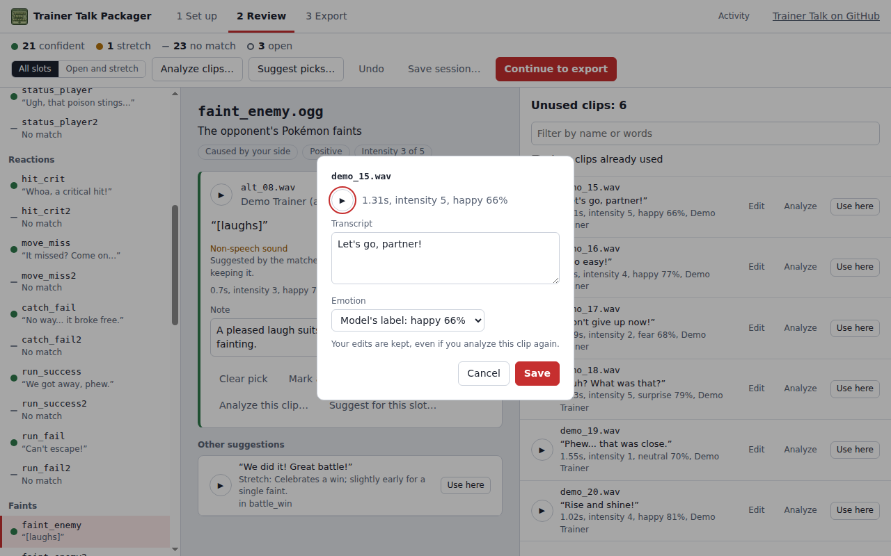
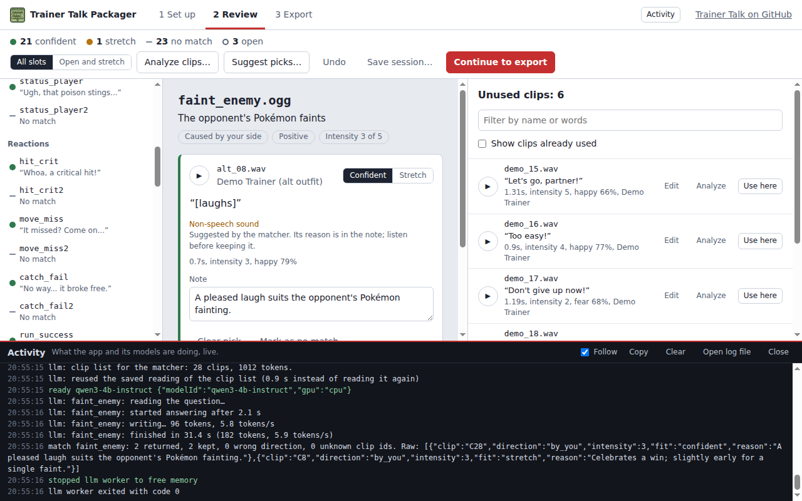

# Trainer Talk Packager

Build character voice packs for [Trainer Talk](https://github.com/ElvieBlooms/Trainer_Talk), the gen1recomp mod that gives trainers voice lines for battles, milestones, and moments in your adventure.

You bring the voice clips: zips of audio you download yourself. The packager helps you sort them into the mod's event slots, then exports a pack ready to drop into the game. No audio is included with this app.



## Download

Get the latest version from the [Releases](https://github.com/ElvieBlooms/Trainer_Talk_Packager/releases) page.

| System | File |
| --- | --- |
| Windows | `Trainer_Talk_Packager-<version>-win-x64.exe` (installer) |
| macOS, Apple Silicon (M1 and newer) | `Trainer_Talk_Packager-<version>-mac-arm64.dmg` |
| macOS, Intel | `Trainer_Talk_Packager-<version>-mac-x64.dmg` |
| Linux | `Trainer_Talk_Packager-<version>-linux-x86_64.AppImage` |

The app isn't code-signed, so your system may warn you the first time:

- **Windows:** if SmartScreen appears, choose **More info**, then **Run anyway**.
- **macOS:** right-click the app and choose **Open**, then confirm. If macOS says the app is damaged, run `xattr -dr com.apple.quarantine "/Applications/Trainer Talk Packager.app"` in Terminal.
- **Linux:** make the AppImage executable (`chmod +x Trainer_Talk_Packager-*.AppImage`), then run it. If it won't start, add `--appimage-extract-and-run` to the command.

## What you need

- **The Trainer Talk mod zip**, from the [Trainer Talk releases](https://github.com/ElvieBlooms/Trainer_Talk/releases).
- **Audio zips for the character** you want to voice. These aren't provided. If you're using a shared recipe, [NEEDED_ZIPS.md](NEEDED_ZIPS.md) lists exactly which zips it expects. Zips can hold `.ogg` or `.wav` clips.

## Making a pack

1. **Set up.**
   - Choose the Trainer Talk mod zip.
   - Pick **Trainer voice** (a character who reacts to your adventure) or **Milestone voice** (Gym Leaders, the Elite Four, and the Champion).
   - Name the pack and add your audio zips. For a character with several outfits, add every zip; they share one pool of clips.
   - If a recipe matches your zips, click **Apply** and most of the work is done.

   

2. **Review.** Every event slot is listed on the left. For each one you can:
   - play the clip that's picked;
   - choose a different clip from the list on the right;
   - mark a pick as a **stretch** if it only partly fits;
   - mark a slot as having **no match**, which leaves it silent in the game.

   Clips the matcher suggested show its reason, with other options underneath.

3. **Export.** You'll see a list of every file and any slots still unfilled before anything is written. Choose one or both:
   - **Pack folder zip:** drop it into an existing install.
   - **Full mod zip:** a fresh copy of Trainer Talk with your pack inside.

   

To install a pack folder, copy it into `mods/trainer_talk/assets/characters/` for trainer packs or `mods/trainer_talk/assets/milestones/` for milestone packs, inside your gen1recomp save folder. The exported zip includes these instructions too.

## Help with sorting clips

The app can listen to your clips and suggest where they go. Everything runs on your computer. Each model downloads once, only after you agree, and the app shows its size first.

- **Transcripts.** Whisper writes down what each clip says, so you can read and search clips instead of playing every one.
- **Emotion.** Each clip is labeled angry, disgust, fear, happy, neutral, sad, or surprise.
- **Intensity.** Each clip gets a 1–5 rating from its loudness and pitch, measured directly from the audio. This needs no download.
- **Suggest picks.** A small language model reads the transcripts, emotions, and intensities, then suggests clips for open slots, each with a reason. It never replaces a pick you've made.

You can run these on everything at once, on a group of slots, or on a single clip or slot, whichever suits your computer. Suggestions are a starting point: listen to each one before keeping it.

| Analyzing clips | Suggesting picks |
| --- | --- |
|  |  |

**Fixing mistakes.** Whisper often mishears Pokémon names. Click **Edit** on any clip to correct its transcript or set its emotion by ear. Your edits are kept, even if you analyze the clip again.



**Picking up where you left off.** **Save session…** stores your progress. If you open a session after moving files, or on another computer, the app looks for the zips next to the session file and asks you to locate any it can't find. Long matching runs also save as they go, so stopping or closing the app doesn't lose finished work.

**Watching it work.** The **Activity** button opens a live log of what the app and its models are doing, including downloads, timings, and any errors.



## Recipes

A recipe is a small file listing which clip goes in which slot. It contains no audio, so it's safe to share. Anyone with the same zips can apply it and get the same pack. Recipes match clips by name and checksum, so they still work if a zip has been repackaged.

- **Using a recipe:** recipes in this repository are built into the app, and the setup screen shows which zips each one needs and which you've already added. You can also import a recipe file someone sends you.
- **Making a recipe:** after reviewing, choose **Save recipe…** on the Export step. It can also save a list of the zips the recipe needs.
- **From a pack that's already in the mod:** under **From a pack in the mod**, choose the pack and click **Match to my zips**. Clips copied straight from a zip match exactly. Re-encoded or trimmed clips can be matched by what they say or by how they sound. For milestone packs, your zips are tagged with each leader's name automatically.

To share a recipe, see [CONTRIBUTING.md](CONTRIBUTING.md).

## Models and system requirements

| Model | Used for | Download |
| --- | --- | --- |
| Whisper Base or Small (English) | Transcripts | A few hundred MB |
| wav2vec2 emotion recognition | Emotion labels | About 380 MB |
| Qwen3 1.7B or Qwen3 4B Instruct | Suggesting picks | About 1.3 GB or 2.4 GB |

- **Memory:** the app loads one model at a time. On a computer with 8 GB of RAM, Whisper, the emotion model, and the Qwen3 1.7B matcher all work. The 4B matcher needs about 4.5 GB free. The app shows each model's needs and warns you if it may not fit.
- **Speed:** on a slower laptop, suggestions take roughly half a minute to a minute per slot. Running a few slots at a time keeps waits short.
- **Graphics card:** the matcher uses the CPU by default. You can turn on the graphics card in the Suggest picks dialog. If the graphics driver crashes, the app switches back to the CPU on its own.

Models, cached results, and the log file are stored in the app's data folder:

- **Windows:** `%APPDATA%\Trainer Talk Packager`
- **macOS:** `~/Library/Application Support/Trainer Talk Packager`
- **Linux:** `~/.config/Trainer Talk Packager`

## Troubleshooting

- **A model won't download.** Check your internet connection and try again. Interrupted downloads resume where they stopped.
- **The app says a model crashed or ran out of memory.** Close other apps, or choose a smaller model: Whisper Base instead of Small, or the 1.7B matcher instead of the 4B.
- **Suggestions are poor.** Correct the transcripts (especially names) and run the matcher again on the slots that need it, or try the 4B matcher if your computer has the memory.
- **Something else.** Open **Activity**, then **Open log file**, and include `packager.log` when you report the problem.

## Building from source

This section is for developers. You need [Node.js](https://nodejs.org) 20 or newer.

```
npm install
npm start
```

- **Tests:** `npm test` runs the test suite. It also checks every recipe in [`recipes/`](recipes/).
- **Installers:** `npm run dist:linux`, `npm run dist:win`, or `npm run dist:mac`. Each must run on its own platform, because the models use native libraries.
- **Releases:** set `"version"` in `package.json`, then push a matching tag (for example `v0.11.0`). GitHub Actions builds all four installers and attaches them to a draft release. Running the workflow by hand from the Actions tab builds them without releasing.
- **Slot list:** the app reads slots from the mod's `schema.json`. Mods without one use the built-in copy in [`schemas/`](schemas/), generated by `npm run schema`.
- **Needed zips:** after merging recipes, run `npm run needed-zips` to update [NEEDED_ZIPS.md](NEEDED_ZIPS.md).
- **Screenshots:** `npm run screenshots` regenerates the images in `docs/screenshots/`. It builds a demo project from synthesized clips and placeholder lines and drives the real app through each step, with no downloads. On Linux without a display, run it with `xvfb-run`.
- **Icon:** the app icon is `build/icon.png` (1024×1024). A smaller copy in `src/renderer/assets/` is used inside the app.

## Licenses

Trainer Talk Packager is released under the [MIT License](LICENSE). See [THIRD_PARTY_NOTICES.md](THIRD_PARTY_NOTICES.md) for the libraries and models it uses.
